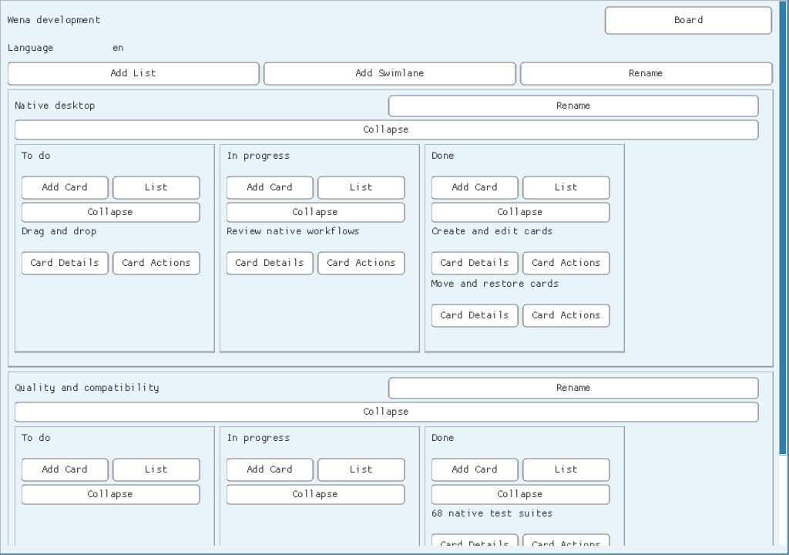

# Continued development — 2026-09-07

This session continued local commit `04afa15`, itself based on upstream Wena
`51f8ad1`. The original bounded Edit title checkpoint remained complete. Work
continued through Add card and several subsequent native component, persistence,
i18n and startup slices in parallel, followed by independent code reviews and
integrated real-SDL checks. No GitHub write, push, PR, tag, release or workflow
execution occurred. No new production dependency or GPL code was introduced.

## Implemented

- **Create cards:** a bounded native editor carries the exact selected board,
  list and rendered swimlane into the existing guarded SQLite transaction.
  Explicit native parents are required; partially supplied server parents fail
  closed. Generated IDs are scoped by actor/route/request. Cache insertion occurs
  only after commit and capacity is checked before the transaction.
- **Create local workspaces:** an explicit `--create` path validates and seeds a
  new schema-v1 database in private adjacent staging, checks and closes it, then
  publishes without replacing an existing file, directory or symlink. Tests
  include concurrent creators, 128-byte hierarchy title bounds, 256-byte actor
  names, invalid migration and injected late seed failure.
- **Move cards:** scoped native selectors use the existing SQLite move operation,
  authoritative versions and idempotency. Committed metadata supplies the actual
  target position. The visible cache is reordered immediately and matches reopen
  order, including moves within the same column.
- **Create and rename hierarchy:** toolbar, list menu and swimlane controls use
  bounded reusable editors and the existing transaction boundary. Board/list/lane
  rename operations retain optimistic guards; new typed list/swimlane creation
  operations enforce scope, capacity, namespace and atomic append positions. No
  new unaudited HTTP route is exposed.
- **Restore archived cards:** a native Archives selector loads authoritative
  archived versions and restores through the same scoped, idempotent adapter.
  Failed mutations preserve selection and cached state; committed restoration
  makes the existing card visible at its preserved position.
- **Runtime language selection:** generated C data contains canonical values for
  the implemented shared-contract keys in all 246 languages. The full original
  offline catalog remains embedded. Runtime labels and locale selection support
  exact underscore/modifier tags, normalization, English fallback and immediate
  switching. The toolbar persists a per-workspace selection and reports failed
  writes without changing the previous language.
- **Readable integrated UI:** sidebar overlay geometry, explicit panel focus,
  card actions routed to details, separate title/action rows, bounded wrapped
  titles and a light native default derived from shared canonical colors. Tests
  check actual drawing commands, complete labels and relevant text contrast.
- **Complete SDL text events:** the Wena platform wrapper validates whole UTF-8
  events before forwarding every code point. Malformed/control/unterminated and
  over-capacity events reject atomically. The desktop compiles every translation
  unit with the same bounded `NK_INPUT_MAX=256` configuration.

## Defects found by integration and review

A moved card formerly kept its old array index until reload. Server title writes
accepted Unicode C1 controls that native board loading rejects. Workspace seeding
accepted titles too long for its editors. An open sidebar closed a newly opened
editor in the same frame. A narrow range of long database paths failed optional
language setup, and failed preference saves had no visible status. Real SDL text
events containing several characters lost all but the first. All were corrected
with targeted regressions.

The Linux desktop test opens the actual board sidebar, clicks Add list, submits
a single multi-character UTF-8 SDL event and saves to SQLite. A temporary negative
control with the sidebar fix removed failed the database assertion, demonstrating
that the test detects the original integration defect. Test-only event injection
adds no production command, hook or dependency.

An apparent disappearing Nuklear popup was separately traced to a test harness
that did not consume commands on mouse-down frames. Real input tests now consume
commands after every frame, as the SDL renderer does. This was a test lifecycle
correction, not evidence of a production popup defect.

## Validation and reproduction

`./build.sh tests all`: **68 PASS, 0 FAIL, 0 SKIP**. The captured output is
[test-results-session-02.txt](test-results-session-02.txt). Counts refer to suites,
not individual assertions. The native desktop build passed. All **25 ASan/UBSan groups passed** with leak
scanning disabled for this container; see
[sanitizer-results-session-02.txt](sanitizer-results-session-02.txt). Runtime translation
checks cover 44 shared UI keys across all 246 catalog languages (10,824 values).

The Linux SDL regression also fails against a temporary build that reinstates
the old single-glyph handler: it saves only `S` instead of the complete title.
Together with the sidebar negative control, this verifies that both integration
regressions detect their respective original defects.

The test environment uses the same GCC, Python, Node, system SQLite 3.45.1 and
SDL2 2.30.0 documented in the [first session report](work-session.md). Matching
official SQLite/SDL header sources were kept in an external temporary toolchain
because development packages were unavailable. They are not Wena dependencies
or part of this repository. On a normal POSIX host, install SDL2 and SQLite
development packages and initialize the pinned Nuklear submodule.

```sh
./build.sh tests all
./build.sh tests sanitizers
./build.sh build desktop
```

For source parity, `WEKAN_ROOT` pointed to canonical WeKan commit
`689a393841f08c3a020a4ef435b869b7641b21df`. C checks use strict C89 with pedantic
errors and warnings treated as errors. The optional sanitizer runner uses both
ASan and UBSan. This container required `ASAN_OPTIONS=detect_leaks=0:halt_on_error=1`;
therefore these results establish no LeakSanitizer coverage. Cross-platform GUI
artifacts, browser E2E, fuzzing and performance were not validated.

## Visual check

The rebuilt SDL executable was also rendered with a representative local board.
This capture is application output at 1024×720 using the dummy SDL driver; it is
not a mockup or evidence of complete WeKan theme parity. It verifies the integrated
light default, complete control labels and separated title rows. The lower lane
continues below the scrollable viewport.



## Remaining boundary

Wena is not yet a complete WeKan replacement. The next checkpoint is native
list/swimlane reordering through the existing guarded movement operations.
Descriptions, comments, checklists, labels/members/activities persistence,
attachments and dates, native drag/drop, complete fonts/RTL/accessibility/theme
parity, remote REST/authentication, import/export, FerretDB conversion and GUI
cross-release packaging remain open. Local actor selection trusts the OS user;
it is not login or membership authorization. The desktop loads a bounded snapshot
at startup and is not a live synchronization client.

See [native desktop](native-desktop.md) for commands and supported interactions,
and [ROADMAP](../ROADMAP.md) for the precise next checkpoint and unchecked goals.
The first session report remains a historical record of its earlier checkpoint.
