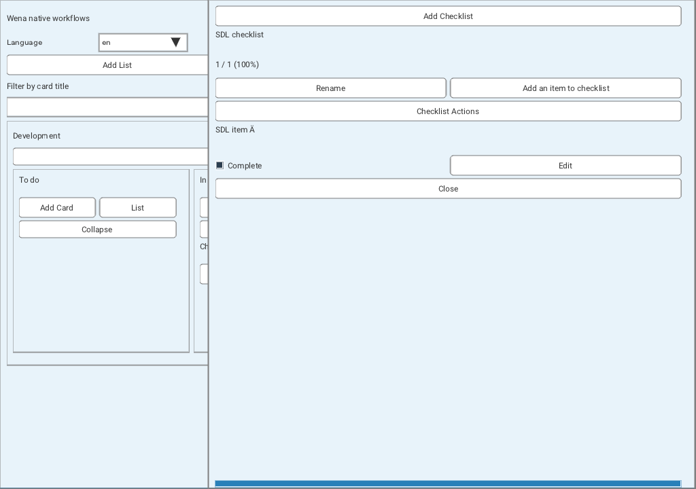

# Coordinated native development — 2026-09-07

This continuation starts from local `0a61868`, following `04afa15` and upstream
`51f8ad1`. The original bounded card-title checkpoint remained complete. Six
parallel agents received successive bounded implementation, review and validation
tasks; the primary agent integrated shared files, desktop routing and migration
worktrees and maintained the roadmap. No GitHub write, push, PR, release, tag or
workflow execution occurred.

## Completed local feature slices

- **Hierarchy and card ordering:** native list/swimlane movement and indexed card
  placement reuse the existing guarded transaction adapter. Complete order
  fingerprints detect concurrent sibling changes. Indexed card movement includes
  archived cards, handles position gaps and compacts only actual moves. No-op
  preserves positions, versions and idempotency metadata; committed caches match
  database reopen order.
- **Card descriptions:** a 0–1024-byte multiline UTF-8 editor supports explicit
  Save/Cancel and shares the card's optimistic version with title/move/archive.
  LF, CR and tab are allowed; malformed UTF-8, NUL and other controls are rejected.
  An additive table and the existing transaction provide rollback, request replay
  rejection and persistence. Plain Enter inserts text, never saves.
- **Checklists:** complete bounded snapshots hold up to 64 checklists and 1024
  items per card. Create/rename lists, add/rename/complete items, and hide checked
  or all items through scoped, versioned callbacks. Progress remains derived from
  all items. Identical saves are guarded no-ops. Failed post-commit refresh disables
  editing and retries only the read, preventing duplicate accepted writes.
- **Confirmed checklist deletion:** explicit item or whole-checklist removal
  shows the exact stored title; a whole-list confirmation includes every affected
  child, including hidden/completed items. Cancel/Escape write nothing and Enter
  cannot confirm. Child/parent deletion, version changes and request metadata
  commit together or roll back. This is permanent native deletion without undo
  or activity-retention parity. Unrelated rows and surviving positions remain.
- **Literal filtering:** bounded session-local title substring filtering keeps
  the complete snapshot, order and exact parent scopes. ASCII case folding and
  non-ASCII byte-exact UTF-8 matching are explicit native limits; this does not
  claim upstream regex/search parity. Clear and draft cancellation are supported.
- **Collapse preferences:** separate files bind exact workspace, local actor and
  board using a shared SHA-256 filename helper. Load validates before publication;
  pruning uses the full snapshot and never writes on startup. Atomic saves reject
  invalid scopes, links and stale temporary files. Failed persistence leaves the
  current session usable and offers an explicit Save retry without a frame loop.
- **Input and focus:** shared single-line Enter/focused Escape behavior and a
  single desktop editor lifecycle prevent stale dialogs. Newly opened panels are
  deferred one input frame so the opening mouse release cannot activate them.
- **Canonical strings and trusted fonts:** all current feature controls/errors
  use the canonical catalog; 78 keys across 246 languages yield 19,188 verified
  translations. Trusted unchanged Roboto bytes add selected Latin, Greek and
  Cyrillic coverage. Source, license and hashes are pinned; there is no runtime
  font-file loading path or new conversion dependency.

Stored minicard inherit/false/true values are validated and preserved, but native
board minicards do not consume them yet. The UI exposes only working hide-checked
and hide-all controls. The canonical bounded item-entry parser is implemented;
atomic multi-item insertion remains a separate future operation.

## Storage, reliability and reduced duplication

One compiled migration registry now verifies exact immutable v1–v4 bytes,
contiguous typed history and additive object definitions. V2 adds descriptions,
v3 checklists/items and v4 a selected-card ordered item index. Old artifacts retain
their original target and reject downgrade. Startup upgrades and old-backup
restores are atomic: restore upgrades its private verified copy before stopping
the listener. Tests include late failure, process termination, concurrent
upgraders, malformed history and altered tables/indexes.

The unchanged checklist query took 48,121 SQLite VM steps for eight selected rows
among 12,008 total rows before the index, and 114 after it. The indexed query still
took 114 steps after doubling unrelated rows, with no full scan or temporary
sort. This measures query work, not a hardware-independent latency promise. The
fixture and measurements use C linked to SQLite 3.51.3; see
[query evidence](checklist-query-work.md).

Strict identifier/title/UTF-8 validation moved into the existing shared model
module. Snapshot validation is shared by SQLite and UI callbacks; counts have no
second persisted source. The native code remains C89, and no parallel mutation or
migration architecture was introduced.

Parser mutation tests reproduced and corrected a real region-encoder buffer
overflow: formatting happened before capacity validation. Full preflight now
preserves output on failure. HTTP/header and region parsers clear failed outputs;
12,344 deterministic mutation cases cover exact capacities, truncation, controls,
numeric edges and partial-state rejection.

Application-owned SQLite connections immediately enable defensive mode and
disable trusted schema, while caller-owned connections retain their own policy.
Language preference saving also gained exclusive temporary files and atomic
replacement checks. These protections do not replace engine updates or establish
that arbitrary database/font files are safe.

## Dependencies and local packaging

Wena source remains MIT, Nuklear uses its pinned MIT alternative, SDL2 is zlib,
SQLite is public domain and the embedded Roboto font retains Apache-2.0 NOTICE.
No GPL code or new runtime library dependency was added. The font is a licensed
data asset, not a claim that all third-party files are MIT.

The dependency review found SQLite's documented WAL-reset issue. Later tests and
builds use an official separately compiled SQLite 3.51.3 amalgamation, verified
against its published SHA3-256, while system libraries were left unchanged.
`--dependency-info` reports actual loaded SDL/SQLite versions and source identity
without opening a workspace or starting video. Deployment needs a maintained
SQLite with the fix or a confirmed distributor backport. See
[dependency review](dependency-audit.md) for hashes and reproduction.

`build desktop-package` verifies a local Linux amd64 archive, extracted startup,
embedded payloads, licenses, file hashes and actual ELF/runtime requirements.
SDL2 and SQLite are shared dependencies. The current host binary requires glibc
2.38 or later; it is not a portable GUI build for every cataloged platform.
Cross-release catalog targets remain bootstrap executables.

## Validation

Final integrated result: **102 suites passed, zero failed or skipped**, and all
**60 ASan/UBSan groups passed** with leak scanning disabled. The explicit host
bootstrap build and verified Linux desktop package also passed. Captured logs:

- [Native suite output](test-results-session-03.txt)
- [ASan/UBSan output](sanitizer-results-session-03.txt)
- [Host build output](host-build-results-session-03.txt)
- [Desktop package output](desktop-package-results-session-03.txt)

Counts refer to suites/groups, not assertions. Earlier 92-suite/50-group and
99-suite/57-group gates are historical checkpoints, not counts to add together.

Actual SDL executable tests exercise sidebar creation, hierarchy movement,
multiline Finnish/Greek description Save/Cancel, checklist create/add/complete,
and collapse persistence across restart and actor changes. Fake UI, real Nuklear,
SQLite integration and domain tests additionally exercise destructive confirmation,
validation, stale versions, scopes, replay, no-op, rollback and reopening.

Reproduce on a POSIX host with SDL2 and SQLite development packages, Python 3,
a C compiler and the pinned Nuklear submodule:

```sh
./build.sh tests all
./build.sh tests sanitizers
./build.sh build host
./build.sh build desktop
./build.sh build desktop-package
```

The source parity checkout is pinned through `WEKAN_ROOT` to WeKan
`689a393841f08c3a020a4ef435b869b7641b21df`. Optional JavaScript VM tests use Node.
C checks use `-std=c89 -pedantic-errors -Wall -Wextra -Werror`. This container
requires `ASAN_OPTIONS=detect_leaks=0:halt_on_error=1`; therefore LeakSanitizer is
not covered. Browser E2E, GUI cross-platform releases, full accessibility/RTL,
universal font coverage and exhaustive performance/fuzz testing remain open.

## Visual inspection

The final SDL executable was rendered at 1024×720 through the dummy video driver.
Actual SDL events opened the checklist panel, created a checklist, added a Finnish
item title and marked it complete. The resulting application capture confirms
readable controls, the accented glyph and derived progress; it is not a mockup
or evidence of full responsive/theme parity.



## Remaining work

Wena is still an incomplete WeKan implementation. Remaining native collections
include labels/card assignments, members/authorization, comments, attachments,
dates and transactional activities. Checklists still need reordering, cross-card
movement, atomic batch entry and board minicard presentation. Broader work includes
drag/drop, responsive/touch/accessibility/theme parity, complete Unicode/RTL,
remote REST/authentication/synchronization, import/export and direct FerretDB
conversion, plus GUI builds and execution on the other target platforms.

See [ROADMAP](../ROADMAP.md), [native desktop](native-desktop.md) and the
[component inventory](native-parity-gaps.md). Local actor selection trusts the OS
user; it is not login or board-membership authorization. The desktop is a bounded
snapshot client, not a live synchronization client. No unfinished broad goal is
marked complete by this report.
